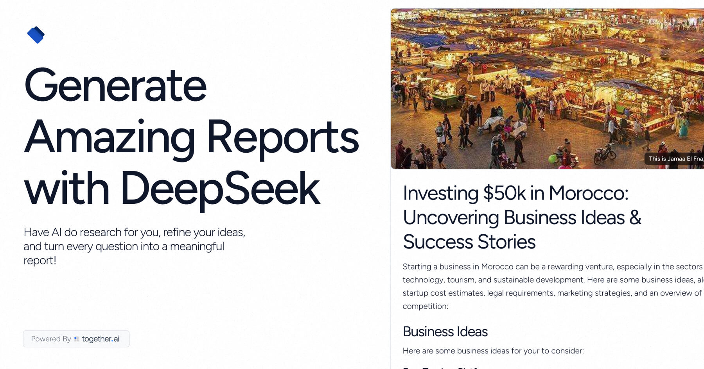

    <h1>DeepSeek Research</h1>
    

        AI-powered research reports. Ask a question, get a comprehensive, sourced answer.
    

## Tech Stack

- **Next.js 15** with App Router for modern web development
- **Together.ai** for advanced LLM research, planning, and summarization
- **Clerk** for authentication
- **Drizzle ORM** and **Neon** for database management
- **Amazon S3** for secure image storage
- **Upstash QStash/Redis** for workflow orchestration and state
- **Vercel** for seamless deployment and hosting

## How it works

1. User asks a research question
2. The app generates a research plan and search queries using Together.ai
3. It performs iterative web searches, summarizes results, and evaluates if more research is needed
4. The app generates a comprehensive report, including sources and a cover image
5. The final report is stored and displayed to the user

## Cloning & running

1. Fork or clone the repo
2. Create accounts at [Together.ai](https://togetherai.link) and [AWS](https://aws.amazon.com/) for LLM and S3
3. Set up Clerk for authentication ([Clerk.dev](https://clerk.dev/))
4. Create a `.env` file (use `.example.env` for reference) and add your API keys
5. Run `pnpm install` and `pnpm run dev` to install dependencies and start the app locally
