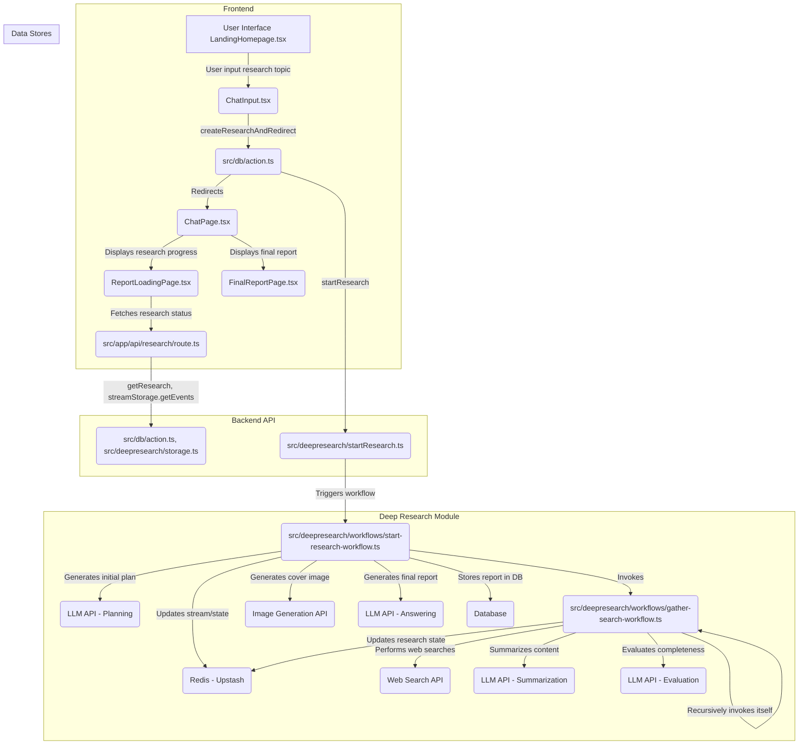

# Architecture



# Sequential agents
Sequential agents¶
The SequentialAgent¶
The SequentialAgent is a workflow agent that executes its sub-agents in the order they are specified in the list.

Use the SequentialAgent when you want the execution to occur in a fixed, strict order.

Example¶
You want to build an agent that can summarize any webpage, using two tools: Get Page Contents and Summarize Page. Because the agent must always call Get Page Contents before calling Summarize Page (you can't summarize from nothing!), you should build your agent using a SequentialAgent.
As with other workflow agents, the SequentialAgent is not powered by an LLM, and is thus deterministic in how it executes. That being said, workflow agents are concerned only with their execution (i.e. in sequence), and not their internal logic; the tools or sub-agents of a workflow agent may or may not utilize LLMs.

How it works¶
When the SequentialAgent's Run Async method is called, it performs the following actions:

Iteration: It iterates through the sub agents list in the order they were provided.
Sub-Agent Execution: For each sub-agent in the list, it calls the sub-agent's Run Async method.
Sequential Agent

Full Example: Code Development Pipeline¶
Consider a simplified code development pipeline:

Code Writer Agent: An LLM Agent that generates initial code based on a specification.
Code Reviewer Agent: An LLM Agent that reviews the generated code for errors, style issues, and adherence to best practices. It receives the output of the Code Writer Agent.
Code Refactorer Agent: An LLM Agent that takes the reviewed code (and the reviewer's comments) and refactors it to improve quality and address issues.
A SequentialAgent is perfect for this:


SequentialAgent(sub_agents=[CodeWriterAgent, CodeReviewerAgent, CodeRefactorerAgent])
This ensures the code is written, then reviewed, and finally refactored, in a strict, dependable order. The output from each sub-agent is passed to the next by storing them in state via Output Key.

~~~
# Part of agent.py --> Follow https://google.github.io/adk-docs/get-started/quickstart/ to learn the setup

# --- 1. Define Sub-Agents for Each Pipeline Stage ---

# Code Writer Agent
# Takes the initial specification (from user query) and writes code.
code_writer_agent = LlmAgent(
    name="CodeWriterAgent",
    model=GEMINI_MODEL,
    # Change 3: Improved instruction
    instruction="""You are a Python Code Generator.
Based *only* on the user's request, write Python code that fulfills the requirement.
Output *only* the complete Python code block, enclosed in triple backticks (```python ... ```). 
Do not add any other text before or after the code block.
""",
    description="Writes initial Python code based on a specification.",
    output_key="generated_code" # Stores output in state['generated_code']
)

# Code Reviewer Agent
# Takes the code generated by the previous agent (read from state) and provides feedback.
code_reviewer_agent = LlmAgent(
    name="CodeReviewerAgent",
    model=GEMINI_MODEL,
    # Change 3: Improved instruction, correctly using state key injection
    instruction="""You are an expert Python Code Reviewer. 
    Your task is to provide constructive feedback on the provided code.

    **Code to Review:**
    ```python
    {generated_code}
    ```

**Review Criteria:**
1.  **Correctness:** Does the code work as intended? Are there logic errors?
2.  **Readability:** Is the code clear and easy to understand? Follows PEP 8 style guidelines?
3.  **Efficiency:** Is the code reasonably efficient? Any obvious performance bottlenecks?
4.  **Edge Cases:** Does the code handle potential edge cases or invalid inputs gracefully?
5.  **Best Practices:** Does the code follow common Python best practices?

**Output:**
Provide your feedback as a concise, bulleted list. Focus on the most important points for improvement.
If the code is excellent and requires no changes, simply state: "No major issues found."
Output *only* the review comments or the "No major issues" statement.
""",
    description="Reviews code and provides feedback.",
    output_key="review_comments", # Stores output in state['review_comments']
)


# Code Refactorer Agent
# Takes the original code and the review comments (read from state) and refactors the code.
code_refactorer_agent = LlmAgent(
    name="CodeRefactorerAgent",
    model=GEMINI_MODEL,
    # Change 3: Improved instruction, correctly using state key injection
    instruction="""You are a Python Code Refactoring AI.
Your goal is to improve the given Python code based on the provided review comments.

  **Original Code:**
  ```python
  {generated_code}
  ```

  **Review Comments:**
  {review_comments}

**Task:**
Carefully apply the suggestions from the review comments to refactor the original code.
If the review comments state "No major issues found," return the original code unchanged.
Ensure the final code is complete, functional, and includes necessary imports and docstrings.

**Output:**
Output *only* the final, refactored Python code block, enclosed in triple backticks (```python ... ```). 
Do not add any other text before or after the code block.
""",
    description="Refactors code based on review comments.",
    output_key="refactored_code", # Stores output in state['refactored_code']
)


# --- 2. Create the SequentialAgent ---
# This agent orchestrates the pipeline by running the sub_agents in order.
code_pipeline_agent = SequentialAgent(
    name="CodePipelineAgent",
    sub_agents=[code_writer_agent, code_reviewer_agent, code_refactorer_agent],
    description="Executes a sequence of code writing, reviewing, and refactoring.",
    # The agents will run in the order provided: Writer -> Reviewer -> Refactorer
)

# For ADK tools compatibility, the root agent must be named `root_agent`
root_agent = code_pipeline_agent
~~~

# LoopAgent
Loop agents¶
The LoopAgent¶
The LoopAgent is a workflow agent that executes its sub-agents in a loop (i.e. iteratively). It repeatedly runs a sequence of agents for a specified number of iterations or until a termination condition is met.

Use the LoopAgent when your workflow involves repetition or iterative refinement, such as like revising code.

Example¶
You want to build an agent that can generate images of food, but sometimes when you want to generate a specific number of items (e.g. 5 bananas), it generates a different number of those items in the image (e.g. an image of 7 bananas). You have two tools: Generate Image, Count Food Items. Because you want to keep generating images until it either correctly generates the specified number of items, or after a certain number of iterations, you should build your agent using a LoopAgent.
As with other workflow agents, the LoopAgent is not powered by an LLM, and is thus deterministic in how it executes. That being said, workflow agents are only concerned only with their execution (i.e. in a loop), and not their internal logic; the tools or sub-agents of a workflow agent may or may not utilize LLMs.

How it Works¶
When the LoopAgent's Run Async method is called, it performs the following actions:

Sub-Agent Execution: It iterates through the Sub Agents list in order. For each sub-agent, it calls the agent's Run Async method.
Termination Check:

Crucially, the LoopAgent itself does not inherently decide when to stop looping. You must implement a termination mechanism to prevent infinite loops. Common strategies include:

Max Iterations: Set a maximum number of iterations in the LoopAgent. The loop will terminate after that many iterations.
Escalation from sub-agent: Design one or more sub-agents to evaluate a condition (e.g., "Is the document quality good enough?", "Has a consensus been reached?"). If the condition is met, the sub-agent can signal termination (e.g., by raising a custom event, setting a flag in a shared context, or returning a specific value).
Loop Agent

Full Example: Iterative Document Improvement¶
Imagine a scenario where you want to iteratively improve a document:

Writer Agent: An LlmAgent that generates or refines a draft on a topic.
Critic Agent: An LlmAgent that critiques the draft, identifying areas for improvement.


LoopAgent(sub_agents=[WriterAgent, CriticAgent], max_iterations=5)
In this setup, the LoopAgent would manage the iterative process. The CriticAgent could be designed to return a "STOP" signal when the document reaches a satisfactory quality level, preventing further iterations. Alternatively, the max iterations parameter could be used to limit the process to a fixed number of cycles, or external logic could be implemented to make stop decisions. The loop would run at most five times, ensuring the iterative refinement doesn't continue indefinitely.

~~~
# Part of agent.py --> Follow https://google.github.io/adk-docs/get-started/quickstart/ to learn the setup

import asyncio
import os
from google.adk.agents import LoopAgent, LlmAgent, BaseAgent, SequentialAgent
from google.genai import types
from google.adk.runners import InMemoryRunner
from google.adk.agents.invocation_context import InvocationContext
from google.adk.tools.tool_context import ToolContext
from typing import AsyncGenerator, Optional
from google.adk.events import Event, EventActions

# --- Constants ---
APP_NAME = "doc_writing_app_v3" # New App Name
USER_ID = "dev_user_01"
SESSION_ID_BASE = "loop_exit_tool_session" # New Base Session ID
GEMINI_MODEL = "gemini-2.0-flash"
STATE_INITIAL_TOPIC = "initial_topic"

# --- State Keys ---
STATE_CURRENT_DOC = "current_document"
STATE_CRITICISM = "criticism"
# Define the exact phrase the Critic should use to signal completion
COMPLETION_PHRASE = "No major issues found."

# --- Tool Definition ---
def exit_loop(tool_context: ToolContext):
  """Call this function ONLY when the critique indicates no further changes are needed, signaling the iterative process should end."""
  print(f"  [Tool Call] exit_loop triggered by {tool_context.agent_name}")
  tool_context.actions.escalate = True
  # Return empty dict as tools should typically return JSON-serializable output
  return {}

# --- Agent Definitions ---

# STEP 1: Initial Writer Agent (Runs ONCE at the beginning)
initial_writer_agent = LlmAgent(
    name="InitialWriterAgent",
    model=GEMINI_MODEL,
    include_contents='none',
    # MODIFIED Instruction: Ask for a slightly more developed start
    instruction=f"""You are a Creative Writing Assistant tasked with starting a story.
    Write the *first draft* of a short story (aim for 2-4 sentences).
    Base the content *only* on the topic provided below. Try to introduce a specific element (like a character, a setting detail, or a starting action) to make it engaging.
    Topic: {{initial_topic}}

    Output *only* the story/document text. Do not add introductions or explanations.
""",
    description="Writes the initial document draft based on the topic, aiming for some initial substance.",
    output_key=STATE_CURRENT_DOC
)

# STEP 2a: Critic Agent (Inside the Refinement Loop)
critic_agent_in_loop = LlmAgent(
    name="CriticAgent",
    model=GEMINI_MODEL,
    include_contents='none',
    # MODIFIED Instruction: More nuanced completion criteria, look for clear improvement paths.
    instruction=f"""You are a Constructive Critic AI reviewing a short document draft (typically 2-6 sentences). Your goal is balanced feedback.

    **Document to Review:**
    ```
    {{current_document}}
    ```

    **Task:**
    Review the document for clarity, engagement, and basic coherence according to the initial topic (if known).

    IF you identify 1-2 *clear and actionable* ways the document could be improved to better capture the topic or enhance reader engagement (e.g., "Needs a stronger opening sentence", "Clarify the character's goal"):
    Provide these specific suggestions concisely. Output *only* the critique text.

    ELSE IF the document is coherent, addresses the topic adequately for its length, and has no glaring errors or obvious omissions:
    Respond *exactly* with the phrase "{COMPLETION_PHRASE}" and nothing else. It doesn't need to be perfect, just functionally complete for this stage. Avoid suggesting purely subjective stylistic preferences if the core is sound.

    Do not add explanations. Output only the critique OR the exact completion phrase.
""",
    description="Reviews the current draft, providing critique if clear improvements are needed, otherwise signals completion.",
    output_key=STATE_CRITICISM
)


# STEP 2b: Refiner/Exiter Agent (Inside the Refinement Loop)
refiner_agent_in_loop = LlmAgent(
    name="RefinerAgent",
    model=GEMINI_MODEL,
    # Relies solely on state via placeholders
    include_contents='none',
    instruction=f"""You are a Creative Writing Assistant refining a document based on feedback OR exiting the process.
    **Current Document:**
    ```
    {{current_document}}
    ```
    **Critique/Suggestions:**
    {{criticism}}

    **Task:**
    Analyze the 'Critique/Suggestions'.
    IF the critique is *exactly* "{COMPLETION_PHRASE}":
    You MUST call the 'exit_loop' function. Do not output any text.
    ELSE (the critique contains actionable feedback):
    Carefully apply the suggestions to improve the 'Current Document'. Output *only* the refined document text.

    Do not add explanations. Either output the refined document OR call the exit_loop function.
""",
    description="Refines the document based on critique, or calls exit_loop if critique indicates completion.",
    tools=[exit_loop], # Provide the exit_loop tool
    output_key=STATE_CURRENT_DOC # Overwrites state['current_document'] with the refined version
)


# STEP 2: Refinement Loop Agent
refinement_loop = LoopAgent(
    name="RefinementLoop",
    # Agent order is crucial: Critique first, then Refine/Exit
    sub_agents=[
        critic_agent_in_loop,
        refiner_agent_in_loop,
    ],
    max_iterations=5 # Limit loops
)

# STEP 3: Overall Sequential Pipeline
# For ADK tools compatibility, the root agent must be named `root_agent`
root_agent = SequentialAgent(
    name="IterativeWritingPipeline",
    sub_agents=[
        initial_writer_agent, # Run first to create initial doc
        refinement_loop       # Then run the critique/refine loop
    ],
    description="Writes an initial document and then iteratively refines it with critique using an exit tool."
)
~~~

# Parallel Agent
Parallel agents¶
The ParallelAgent is a workflow agent that executes its sub-agents concurrently. This dramatically speeds up workflows where tasks can be performed independently.

Use ParallelAgent when: For scenarios prioritizing speed and involving independent, resource-intensive tasks, a ParallelAgent facilitates efficient parallel execution. When sub-agents operate without dependencies, their tasks can be performed concurrently, significantly reducing overall processing time.

As with other workflow agents, the ParallelAgent is not powered by an LLM, and is thus deterministic in how it executes. That being said, workflow agents are only concerned with their execution (i.e. executing sub-agents in parallel), and not their internal logic; the tools or sub-agents of a workflow agent may or may not utilize LLMs.

Example¶
This approach is particularly beneficial for operations like multi-source data retrieval or heavy computations, where parallelization yields substantial performance gains. Importantly, this strategy assumes no inherent need for shared state or direct information exchange between the concurrently executing agents.

How it works¶
When the ParallelAgent's run_async() method is called:

Concurrent Execution: It initiates the run_async() method of each sub-agent present in the sub_agents list concurrently. This means all the agents start running at (approximately) the same time.
Independent Branches: Each sub-agent operates in its own execution branch. There is no automatic sharing of conversation history or state between these branches during execution.
Result Collection: The ParallelAgent manages the parallel execution and, typically, provides a way to access the results from each sub-agent after they have completed (e.g., through a list of results or events). The order of results may not be deterministic.
Independent Execution and State Management¶
It's crucial to understand that sub-agents within a ParallelAgent run independently. If you need communication or data sharing between these agents, you must implement it explicitly. Possible approaches include:

Shared InvocationContext: You could pass a shared InvocationContext object to each sub-agent. This object could act as a shared data store. However, you'd need to manage concurrent access to this shared context carefully (e.g., using locks) to avoid race conditions.
External State Management: Use an external database, message queue, or other mechanism to manage shared state and facilitate communication between agents.
Post-Processing: Collect results from each branch, and then implement logic to coordinate data afterwards.
Parallel Agent


Full Example: Parallel Web Research¶
Imagine researching multiple topics simultaneously:

Researcher Agent 1: An LlmAgent that researches "renewable energy sources."
Researcher Agent 2: An LlmAgent that researches "electric vehicle technology."
Researcher Agent 3: An LlmAgent that researches "carbon capture methods."


ParallelAgent(sub_agents=[ResearcherAgent1, ResearcherAgent2, ResearcherAgent3])
These research tasks are independent. Using a ParallelAgent allows them to run concurrently, potentially reducing the total research time significantly compared to running them sequentially. The results from each agent would be collected separately after they finish.


~~~
 # Part of agent.py --> Follow https://google.github.io/adk-docs/get-started/quickstart/ to learn the setup
 # --- 1. Define Researcher Sub-Agents (to run in parallel) ---

 # Researcher 1: Renewable Energy
 researcher_agent_1 = LlmAgent(
     name="RenewableEnergyResearcher",
     model=GEMINI_MODEL,
     instruction="""You are an AI Research Assistant specializing in energy.
 Research the latest advancements in 'renewable energy sources'.
 Use the Google Search tool provided.
 Summarize your key findings concisely (1-2 sentences).
 Output *only* the summary.
 """,
     description="Researches renewable energy sources.",
     tools=[google_search],
     # Store result in state for the merger agent
     output_key="renewable_energy_result"
 )

 # Researcher 2: Electric Vehicles
 researcher_agent_2 = LlmAgent(
     name="EVResearcher",
     model=GEMINI_MODEL,
     instruction="""You are an AI Research Assistant specializing in transportation.
 Research the latest developments in 'electric vehicle technology'.
 Use the Google Search tool provided.
 Summarize your key findings concisely (1-2 sentences).
 Output *only* the summary.
 """,
     description="Researches electric vehicle technology.",
     tools=[google_search],
     # Store result in state for the merger agent
     output_key="ev_technology_result"
 )

 # Researcher 3: Carbon Capture
 researcher_agent_3 = LlmAgent(
     name="CarbonCaptureResearcher",
     model=GEMINI_MODEL,
     instruction="""You are an AI Research Assistant specializing in climate solutions.
 Research the current state of 'carbon capture methods'.
 Use the Google Search tool provided.
 Summarize your key findings concisely (1-2 sentences).
 Output *only* the summary.
 """,
     description="Researches carbon capture methods.",
     tools=[google_search],
     # Store result in state for the merger agent
     output_key="carbon_capture_result"
 )

 # --- 2. Create the ParallelAgent (Runs researchers concurrently) ---
 # This agent orchestrates the concurrent execution of the researchers.
 # It finishes once all researchers have completed and stored their results in state.
 parallel_research_agent = ParallelAgent(
     name="ParallelWebResearchAgent",
     sub_agents=[researcher_agent_1, researcher_agent_2, researcher_agent_3],
     description="Runs multiple research agents in parallel to gather information."
 )

 # --- 3. Define the Merger Agent (Runs *after* the parallel agents) ---
 # This agent takes the results stored in the session state by the parallel agents
 # and synthesizes them into a single, structured response with attributions.
 merger_agent = LlmAgent(
     name="SynthesisAgent",
     model=GEMINI_MODEL,  # Or potentially a more powerful model if needed for synthesis
     instruction="""You are an AI Assistant responsible for combining research findings into a structured report.

 Your primary task is to synthesize the following research summaries, clearly attributing findings to their source areas. Structure your response using headings for each topic. Ensure the report is coherent and integrates the key points smoothly.

 **Crucially: Your entire response MUST be grounded *exclusively* on the information provided in the 'Input Summaries' below. Do NOT add any external knowledge, facts, or details not present in these specific summaries.**

 **Input Summaries:**

 *   **Renewable Energy:**
     {renewable_energy_result}

 *   **Electric Vehicles:**
     {ev_technology_result}

 *   **Carbon Capture:**
     {carbon_capture_result}

 **Output Format:**

 ## Summary of Recent Sustainable Technology Advancements

 ### Renewable Energy Findings
 (Based on RenewableEnergyResearcher's findings)
 [Synthesize and elaborate *only* on the renewable energy input summary provided above.]

 ### Electric Vehicle Findings
 (Based on EVResearcher's findings)
 [Synthesize and elaborate *only* on the EV input summary provided above.]

 ### Carbon Capture Findings
 (Based on CarbonCaptureResearcher's findings)
 [Synthesize and elaborate *only* on the carbon capture input summary provided above.]

 ### Overall Conclusion
 [Provide a brief (1-2 sentence) concluding statement that connects *only* the findings presented above.]

 Output *only* the structured report following this format. Do not include introductory or concluding phrases outside this structure, and strictly adhere to using only the provided input summary content.
 """,
     description="Combines research findings from parallel agents into a structured, cited report, strictly grounded on provided inputs.",
     # No tools needed for merging
     # No output_key needed here, as its direct response is the final output of the sequence
 )


 # --- 4. Create the SequentialAgent (Orchestrates the overall flow) ---
 # This is the main agent that will be run. It first executes the ParallelAgent
 # to populate the state, and then executes the MergerAgent to produce the final output.
 sequential_pipeline_agent = SequentialAgent(
     name="ResearchAndSynthesisPipeline",
     # Run parallel research first, then merge
     sub_agents=[parallel_research_agent, merger_agent],
     description="Coordinates parallel research and synthesizes the results."
 )

 root_agent = sequential_pipeline_agent
~~~
# Agent Development Kit (ADK)

## High-Level Summary

The Agent Development Kit (ADK) is an open-source, code-first Python toolkit designed for developers building, evaluating, and deploying sophisticated AI agents, with a strong focus on integration with Google Cloud services and Gemini models. It emphasizes flexibility and fine-grained control over agent behavior, orchestration, and tool usage directly within Python code.

**Key Features:**

*   **Rich Tool Ecosystem:** Supports built-in tools (Google Search, Code Execution, Vertex AI Search), custom Python functions, OpenAPI spec integration, third-party libraries (LangChain, CrewAI), Google Cloud integrations (API Hub, Application Integration, MCP Toolbox for DBs), MCP standard tools, and using other agents as tools. Includes robust authentication handling.
*   **Code-First Development:** Define agent logic, workflows, and state management directly in Python, enabling testability, versioning, and debugging.
*   **Flexible Orchestration:** Build multi-agent systems using predefined workflow agents (`SequentialAgent`, `ParallelAgent`, `LoopAgent`) for structured processes or leverage `LlmAgent` for dynamic, LLM-driven routing and decision-making. Custom agents (`BaseAgent`) allow for arbitrary logic.
*   **Context & State Management:** Provides mechanisms for managing conversational context (`Session`), short-term state (`State` with session/user/app/temp scopes), long-term memory (`MemoryService`), and binary data (`ArtifactService`).
*   **Callbacks for Control:** Offers hooks (`before/after_agent`, `before/after_model`, `before/after_tool`) to observe, customize, or intercept agent execution flow for logging, validation, guardrails, caching, and more.
*   **Deployment Ready:** Facilitates deployment to various environments, including local testing, Google Cloud Run, and the scalable Vertex AI Agent Engine.
*   **Evaluation Framework:** Includes tools and patterns for evaluating agent performance based on trajectory (tool usage) and final response quality against predefined test cases.
*   **Responsible AI:** Provides guidance and mechanisms (guardrails, callbacks, identity management) for building safer and more secure agents.

The documentation covers getting started guides (installation, quickstarts, tutorial), core concepts (agents, tools, sessions, context, runtime, events), advanced topics (multi-agent systems, callbacks, custom agents, memory, artifacts, authentication), deployment strategies, evaluation methods, and responsible AI practices. Code examples and snippets illustrate key functionalities.


### **Table of Contents**

1. **Introduction to Agent Development Kit (ADK)**  
   * What is ADK?  
   * Core Concepts  
   * Key Capabilities  
2. **Getting Started**  
   * Installation  
   * Quickstart (Basic Agent)  
   * Quickstart (Streaming)  
3. **Agent Fundamentals**  
   * Types of Agents  
     * LLM Agents (LlmAgent, Agent)  
     * Workflow Agents (SequentialAgent, ParallelAgent, LoopAgent)  
     * Custom Agents  
   * Multi-Agent Systems  
     * Agent Hierarchy  
     * Workflow Agents as Orchestrators  
     * Interaction & Communication Mechanisms  
     * Common Multi-Agent Patterns  
4. **Tools and Capabilities**  
   * What is a Tool?  
   * How Agents Use Tools  
   * Tool Types in ADK  
     * Function Tools  
       * Function Tool  
       * Long Running Function Tool  
       * Agent-as-a-Tool  
     * Built-in Tools  
       * Google Search  
       * Code Execution  
       * Vertex AI Search  
     * Third-Party Tools  
       * LangChain Tools  
       * CrewAI Tools  
     * Google Cloud Tools  
       * Apigee API Hub Tools  
       * Application Integration Tools  
       * Toolbox Tools for Databases  
     * OpenAPI Integration  
     * Model Context Protocol (MCP) Tools  
   * Tool Context  
   * Defining Effective Tool Functions  
   * Toolsets  
   * Authentication with Tools  
5. **Conversational Context and Runtime**  
   * Session, State, and Memory  
     * Session  
     * State  
     * Memory  
   * Events  
   * Context  
   * Runtime  
     * Runtime Configuration (RunConfig)  
6. **Deployment**  
   * Deployment Options  
     * Agent Engine in Vertex AI  
     * Cloud Run  
     * GKE  
7. **Evaluation and Safety**  
   * Why Evaluate Agents?  
     * Evaluation Approaches  
     * Evaluation Criteria  
     * Running Evaluation  
   * Safety & Security for AI Agents  
     * Best Practices  
8. **Community Resources and Contribution**  
   * Community Resources  
   * Contributing Guide

### ---

**1\. Introduction to Agent Development Kit (ADK)**

The Agent Development Kit (ADK) is a flexible and modular framework developed by Google for building, managing, evaluating, and deploying AI-powered agents. It is designed to simplify the development of AI agents by providing a robust and flexible environment that makes the process feel more like traditional software development. ADK supports both conversational and non-conversational agents, capable of handling tasks ranging from simple to complex workflows. It is model-agnostic, deployment-agnostic, and built for compatibility with other frameworks.

#### **Core Concepts**

ADK is built around several key primitives that make it powerful and flexible. These include:

* **Agent**: The fundamental worker unit designed for specific tasks. Agents can use language models (LlmAgent) for complex reasoning or act as deterministic controllers for execution, known as "workflow agents" (SequentialAgent, ParallelAgent, LoopAgent).  
* **Tool**: Equips agents with capabilities beyond conversation, allowing them to interact with external APIs, search for information, run code, or call other services.  
* **Callbacks**: Custom code snippets that run at specific points in an agent's process, enabling checks, logging, or behavior modifications.  
* **Session Management (Session & State)**: Handles the context of a single conversation (Session), including its history (Events) and the agent's working memory for that conversation (State).  
* **Memory**: Enables agents to recall information about a user across multiple sessions, providing long-term context distinct from short-term session State.  
* **Artifact Management (Artifact)**: Allows agents to save, load, and manage files or binary data (such as images and PDFs) associated with a session or user.  
* **Code Execution**: The ability for agents, usually via Tools, to generate and execute code for complex calculations or actions.  
* **Planning**: An advanced capability where agents can break down complex goals into smaller steps and plan how to achieve them, similar to a ReAct planner.  
* **Models**: The underlying Large Language Model (LLM) that powers LlmAgents, enabling their reasoning and language understanding abilities.  
* **Event**: The basic unit of communication representing occurrences during a session (user message, agent reply, tool use), forming the conversation history.  
* **Runner**: The engine that manages the execution flow, orchestrates agent interactions based on Events, and coordinates with backend services.

#### **Key Capabilities**

ADK offers several advantages for developing agentic applications. These capabilities include:

* **Multi-Agent System Design**: Facilitates building applications composed of multiple, specialized agents arranged hierarchically, allowing them to coordinate complex tasks and delegate sub-tasks using LLM-driven transfer or explicit AgentTool invocation.  
* **Rich Tool Ecosystem**: Agents can be equipped with diverse capabilities, integrating custom functions (FunctionTool), using other agents as tools (AgentTool), leveraging built-in functionalities like code execution, and interacting with external data sources and APIs (e.g., Search, Databases). Support for long-running tools is also available.  
* **Flexible Orchestration**: Complex agent workflows can be defined using built-in workflow agents (SequentialAgent, ParallelAgent, LoopAgent) alongside LLM-driven dynamic routing, enabling both predictable pipelines and adaptive agent behavior.  
* **Integrated Developer Tooling**: Provides tools like a command-line interface (CLI) and a Developer UI for local development, allowing users to run agents, inspect execution steps, debug interactions, and visualize agent definitions.  
* **Native Streaming Support**: Supports real-time, interactive experiences with bidirectional streaming (text and audio), integrating seamlessly with the Gemini Live API for both Google AI Studio and Vertex AI.  
* **Built-in Agent Evaluation**: Tools are included for systematically assessing agent performance, allowing the creation of multi-turn evaluation datasets and running evaluations locally to measure quality and guide improvements.  
* **Broad LLM Support**: Optimized for Google's Gemini models, the framework is also designed for flexibility, enabling integration with various LLMs, including open-source or fine-tuned models, through its BaseLlm interface.  
* **Artifact Management**: Provides mechanisms (ArtifactService, context methods) for agents to save, load, and manage versioned artifacts such as images, documents, or generated reports during execution.  
* **Extensibility and Interoperability**: Promotes an open ecosystem, allowing developers to integrate and reuse tools from other popular agent frameworks, including LangChain and CrewAI.  
* **State and Memory Management**: Automatically handles short-term conversational memory (State within a Session) managed by the SessionService, and provides integration points for longer-term Memory services for cross-session recall.

### **2\. Getting Started**

#### **Installation**

ADK is available for both Python and Java. For Python, it's recommended to create and activate a virtual environment using venv before installing the google-adk package via pip. For Java, google-adk and google-adk-dev packages can be added via Maven or Gradle dependencies in the pom.xml or build.gradle file, respectively.

#### **Quickstart (Basic Agent)**

The quickstart guides users through creating a basic agent with multiple tools and running it locally. For Python, this involves creating a parent\_folder/multi\_tool\_agent directory structure with \_\_init\_\_.py, agent.py, and a .env file. For Java, the structure typically includes project\_folder/src/main/java/agents/multitool/MultiToolAgent.java and a pom.xml or build.gradle.

The agent.py or MultiToolAgent.java defines the agent, including its name, model (e.g., gemini-2.0-flash), description, instruction, and a list of tools (e.g., get\_weather, get\_current\_time). The .env file or environment variables are used to set up the LLM, either with a Google AI Studio API key (GOOGLE\_API\_KEY, GOOGLE\_GENAI\_USE\_VERTEXAI=FALSE) or Google Cloud Vertex AI project details (GOOGLE\_CLOUD\_PROJECT, GOOGLE\_CLOUD\_LOCATION, GOOGLE\_GENAI\_USE\_VERTEXAI=TRUE).

Agents can be run locally using the adk web command for a browser-based Dev UI, adk run for terminal interaction, or adk api\_server for a local FastAPI server. The Dev UI allows selecting the agent, chatting, and inspecting function calls, responses, and model responses.

#### **Quickstart (Streaming)**

ADK supports real-time, interactive experiences through streaming, including low-latency bidirectional voice and video communication. Supported models for voice/video streaming must support the Gemini Live API, with specific model IDs available in the Google AI Studio and Vertex AI documentation.

For Python, the streaming quickstart involves a similar project structure to the basic quickstart, with an app folder containing .env, main.py, static files (for the web client), and the Google Search\_agent folder. The agent.py defines the agent using a streaming-compatible model (e.g., gemini-2.0-flash-exp) and tools like Google Search. The setup for the LLM platform (Google AI Studio or Google Cloud Vertex AI) is similar to the basic quickstart, requiring API keys or project configurations.

Running the streaming agent locally involves navigating to the app directory, setting SSL\_CERT\_FILE (for wss:// connections), and running adk web. Users can then interact with the agent via text, voice, or video in the Dev UI.

For Java, the streaming quickstart involves setting up a Maven project, adding google-adk and google-adk-dev dependencies in pom.xml, and creating a ScienceTeacherAgent.java. The agent must be initialized as a public static BaseAgent ROOT\_AGENT. Environment variables for the Gemini key and GOOGLE\_GENAI\_USE\_VERTEXAI are also required. The Dev UI can be launched using mvn exec:java. For custom live audio applications, a specific pom.xml and LiveAudioRun.java are provided, demonstrating microphone input and speaker output for real-time voice conversations.

### **3\. Agent Fundamentals**

#### **Types of Agents**

In the Agent Development Kit (ADK), an **Agent** is a self-contained execution unit designed to act autonomously to achieve specific goals. Agents can perform tasks, interact with users, utilize external tools, and coordinate with other agents. The foundation for all agents is the BaseAgent class, which is extended in three main ways:

* **LLM Agents (LlmAgent, Agent)**: These agents use Large Language Models (LLMs) as their core engine to understand natural language, reason, plan, generate responses, and dynamically decide how to proceed or which tools to use. They are ideal for flexible, language-centric tasks and their behavior is non-deterministic. Key parameters include name, description, model, instruction, and tools. Advanced configurations include generate\_content\_config for fine-tuning LLM generation, input\_schema, output\_schema, and output\_key for structuring data, and include\_contents for managing context.  
* **Workflow Agents (SequentialAgent, ParallelAgent, LoopAgent)**: These specialized agents control the execution flow of other agents in predefined, deterministic patterns (sequence, parallel, or loop) without using an LLM for flow control. They are perfect for structured processes needing predictable execution.  
  * SequentialAgent executes sub-agents one after another in the order they are listed, passing the same InvocationContext sequentially.  
  * ParallelAgent executes its sub-agents concurrently, facilitating tasks like multi-source data retrieval or heavy computations. They operate in independent branches, but still access the same shared session.state.  
  * LoopAgent repeatedly runs a sequence of agents for a specified number of iterations or until a termination condition is met. Termination can be set by max\_iterations or by a sub-agent signaling escalation.  
* **Custom Agents**: Created by extending BaseAgent directly, these agents allow for implementing unique operational logic, specific control flows, or specialized integrations not covered by standard types. They provide ultimate flexibility by defining arbitrary orchestration logic.

#### **Multi-Agent Systems**

Complex applications often benefit from structuring multiple, distinct BaseAgent instances into a **Multi-Agent System (MAS)**. This approach enhances modularity, specialization, reusability, maintainability, and allows for structured control flows.

* **Agent Hierarchy**: The foundation for MAS is the parent-child relationship defined in BaseAgent. Agents are passed as a list to the sub\_agents argument when initializing a parent agent, and ADK automatically sets the parent\_agent attribute on each child. An agent instance can only have one parent, and the hierarchy defines the scope for workflow agents and influences LLM-driven delegation targets.  
* **Workflow Agents as Orchestrators**: These specialized agents (e.g., SequentialAgent, ParallelAgent, LoopAgent) are derived from BaseAgent and orchestrate the execution flow of their sub-agents. They define the control flow deterministically without using an LLM for orchestration.  
* **Interaction & Communication Mechanisms**: Agents within a system can exchange data or trigger actions:  
  * **Shared Session State (session.state)**: The most fundamental way for agents to communicate passively within the same invocation. One agent writes a value to context.state\['data\_key'\], and a subsequent agent reads it. The output\_key property on LlmAgent automatically saves the agent's final response to a specified state key.  
  * **LLM-Driven Delegation (Agent Transfer)**: Leverages an LlmAgent's understanding to dynamically route tasks to other suitable agents within the hierarchy. The LLM generates a function call (transfer\_to\_agent(agent\_name='target\_agent\_name')), which the AutoFlow intercepts to switch execution focus. Target agents need distinct descriptions for informed decisions.  
  * **Explicit Invocation (AgentTool)**: Allows an LlmAgent to treat another BaseAgent instance as a callable function or Tool. The target agent is wrapped in AgentTool and included in the parent LlmAgent's tools list. When called, it runs the target agent, captures its final response, and forwards state/artifact changes back to the parent's context.  
* **Common Multi-Agent Patterns**: ADK primitives can be combined to implement various collaboration patterns:  
  * **Coordinator/Dispatcher Pattern**: A central LlmAgent routes incoming requests to specialized sub\_agents using LLM-Driven Delegation or Explicit Invocation (AgentTool).  
  * **Sequential Pipeline Pattern**: A SequentialAgent executes sub\_agents in a fixed order, typically using Shared Session State to pass outputs between steps.  
  * **Parallel Fan-Out/Gather Pattern**: A ParallelAgent runs multiple sub\_agents concurrently, often followed by an agent that aggregates results, using Shared Session State for communication.  
  * **Hierarchical Task Decomposition**: A multi-level tree of agents where higher-level agents break down complex goals and delegate sub-tasks to lower-level agents, using LLM-Driven Delegation or Explicit Invocation (AgentTool).  
  * **Review/Critique Pattern (Generator-Critic)**: Two agents (Generator and Critic/Reviewer) typically work within a SequentialAgent, using Shared Session State to improve output quality.  
  * **Iterative Refinement Pattern**: A LoopAgent executes one or more agents over multiple iterations to progressively improve a result in session state, with termination based on max\_iterations or an escalating signal.  
  * **Human-in-the-Loop Pattern**: Integrates human intervention points using a custom Tool that pauses execution and interacts with an external system for human input.

### **4\. Tools and Capabilities**

#### **What is a Tool?**

A Tool in ADK represents a specific capability provided to an AI agent, enabling it to perform actions and interact with the world beyond its core text generation and reasoning abilities. Tools are action-oriented, extend agent capabilities, and execute predefined logic, allowing agents to access real-time information, affect external systems, and overcome knowledge limitations.

#### **How Agents Use Tools**

Agents leverage tools dynamically through function calling mechanisms. The process involves the agent's LLM reasoning about the user request, selecting the appropriate tool based on available tools and their docstrings, generating required arguments, invoking the tool, receiving its output, and finally incorporating the output into its reasoning process.

#### **Tool Types in ADK**

ADK supports various types of tools:

* **Function Tools**: Custom tools tailored to specific application needs.  
  * **Function Tool**: Regular Python functions or Java methods that perform specific actions. Parameters should use JSON-serializable types and avoid default values. The preferred return type is a dictionary in Python or a Map in Java, which provides context and clarity to the LLM. Docstrings or source code comments serve as the tool's description for the LLM.  
  * **Long Running Function Tool**: Designed for tasks that require significant processing time without blocking the agent's execution, and is a subclass of FunctionTool. The function initiates a long-running operation, optionally returns an initial result, and the agent runner can pause the agent run. The agent client can then query the progress and send back intermediate or final responses.  
  * **Agent-as-a-Tool**: Allows leveraging the capabilities of other agents by calling them as tools, effectively delegating responsibility. Unlike sub-agents, where control is fully transferred, an Agent-as-a-Tool returns its answer back to the calling agent, which then summarizes and responds to the user, retaining control for future input. The AgentTool class is used to wrap the agent.  
* **Built-in Tools**: Ready-to-use tools provided by the framework for common tasks. These include:  
  * **Google Search**: Allows the agent to perform web searches using Google Search, compatible with Gemini 2 models.  
  * **Code Execution**: Enables the agent to execute code using the built\_in\_code\_execution tool, typically with Gemini 2 models, for calculations or data manipulation.  
  * **Vertex AI Search**: Uses Google Cloud's Vertex AI Search for agents to search across private, configured data stores.  
  * **Limitations**: Currently, each root agent or single agent only supports one built-in tool, and no other tools of any type can be used in the same agent. Built-in tools are also not supported within sub-agents.  
* **Third-Party Tools**: Integrates tools from other AI Agent frameworks like CrewAI and LangChain, enabling faster development and reuse of existing tools.  
  * **LangChain Tools**: Uses the LangchainTool wrapper to integrate tools from the LangChain ecosystem (e.g., Tavily search tool).  
  * **CrewAI Tools**: Uses the CrewaiTool wrapper to integrate tools from the CrewAI library (e.g., Serper API for web search).  
* **Google Cloud Tools**: Facilitates connecting agents to Google Cloud products and services.  
  * **Apigee API Hub Tools**: ApiHubToolset allows turning any documented API from Apigee API hub into a tool, supporting various authentication methods.  
  * **Application Integration Tools**: ApplicationIntegrationToolset enables secure and governed access to enterprise applications via Integration Connector's pre-built connectors (e.g., Salesforce, ServiceNow) and existing Application Integration process automations.  
  * **Toolbox Tools for Databases**: Integrates with the open-source MCP Toolbox for Databases server for accessing data in databases like Spanner, AlloyDB, and Postgres.  
* **OpenAPI Integration**: Simplifies interacting with external REST APIs by automatically generating callable tools (RestApiTool) directly from an OpenAPI Specification (v3.x). The OpenAPIToolset parses the spec, discovers operations, generates tools, and handles authentication.  
* **Model Context Protocol (MCP) Tools**: ADK integrates with the Model Context Protocol (MCP), an open standard for LLMs to communicate with external applications, data sources, and tools. This includes using existing MCP servers within ADK (ADK as an MCP client) and exposing ADK tools via an MCP server (MCP server exposing ADK). The MCPToolset class is used to integrate tools from an MCP server, handling connection management, tool discovery, and proxying tool calls.

#### **Tool Context**

For advanced scenarios, tool functions can include a tool\_context: ToolContext parameter in their signature. This object provides access to the current session's state (tool\_context.state), allows influencing agent actions via tool\_context.actions (e.g., skip\_summarization, transfer\_to\_agent, escalate), and offers methods to interact with configured services like Artifacts and Memory. It also includes function\_call\_id for tracking tool invocations and auth\_response for authentication.

#### **Defining Effective Tool Functions**

The effectiveness of an agent's tool usage heavily depends on how the tool functions are defined. Key guidelines include:

* **Function Name**: Use descriptive, verb-noun based names that clearly indicate the action (e.g., get\_weather, searchDocuments).  
* **Parameters (Arguments)**: Use clear and descriptive names, provide type hints in Python, and ensure all parameter types are JSON serializable. Avoid setting default values for parameters.  
* **Return Type**: Must be a dictionary in Python or a Map in Java. Design the dictionary/Map keys and values to be descriptive and easily understood by the LLM, often including a status key.  
* **Docstring / Source Code Comments**: Critical for describing what the tool does, when it should be used, explaining each parameter, and describing the expected return value structure. The tool\_context parameter should not be described in the docstring.  
* **Simplicity and Focus**: Keep tools focused on one well-defined task, minimize parameters, use simple data types, and decompose complex tasks into smaller, more focused tools.

#### **Toolsets**

Toolsets, via the BaseToolset interface, allow for managing and providing a collection of BaseTool instances, often dynamically, to an agent. This is beneficial for organizing related tools, enabling dynamic tool availability based on context, and integrating external tool providers. The BaseToolset defines get\_tools() to return a list of BaseTool instances and close() for cleanup.

#### **Authentication with Tools**

Many tools require authentication to access protected resources. ADK provides a system to handle various authentication methods securely. Key components include AuthScheme (defines how API expects credentials, e.g., API Key, OAuth 2.0) and AuthCredential (holds initial information to start authentication, e.g., OAuth Client ID/Secret). Supported initial credential types include API\_KEY, HTTP, OAUTH2, OPEN\_ID\_CONNECT, and SERVICE\_ACCOUNT. Authentication is configured on tools during initialization, with different methods for OpenAPI-based Toolsets and Google API Toolsets. The system handles interactive OAuth/OIDC flows, where the Agent Client application redirects the user for authorization and then sends the authentication result back to ADK.

### **5\. Conversational Context and Runtime**

#### **Session, State, and Memory**

Meaningful, multi-turn conversations require agents to understand context. ADK manages this through Session, State, and Memory.

* **Session**: Represents a single, ongoing interaction between a user and the agent system. It contains a chronological sequence of Events (messages and actions) and can hold temporary data (State) relevant only to that conversation. Key properties include id, appName, userId for identification, events for history, state for session-specific data, and lastUpdateTime for activity tracking. SessionService manages the lifecycle of Session objects. Implementations include InMemorySessionService (non-persistent) and VertexAiSessionService or DatabaseSessionService (persistent).  
* **State (session.state)**: A dictionary or Map within each Session for storing and updating dynamic details needed during the conversation. It holds serializable key-value pairs and its persistence depends on the SessionService. State can be organized using prefixes: no prefix for session-specific, user: for user-specific across sessions, app: for app-wide, and temp: for temporary state not persisted. State should be updated by adding an Event to the session history via session\_service.append\_event(), either through output\_key for agent text responses or EventActions.state\_delta for complex updates.  
* **Memory**: A searchable store of information that can span multiple past sessions or include external data sources. MemoryService defines the interface for managing this long-term knowledge, handling ingestion of session information (add\_session\_to\_memory) and searching (search\_memory). Implementations include InMemoryMemoryService (in-memory, non-persistent) and VertexAiRagMemoryService (persistent, leverages Vertex AI RAG Corpus).

#### **Events**

Events are the fundamental units of information flow within ADK, representing every significant occurrence during an agent's interaction lifecycle. An Event is an immutable record capturing user messages, agent replies, tool requests, tool results, state changes, control signals, and errors. Events are central for communication, signaling state/artifact changes, controlling flow, and providing history. Events can be identified by event.author (e.g., 'user', 'AgentName'), event.content (text, tool call, tool result), and event.partial for streaming output. Key information can be extracted from event.content.parts\[0\].text for text, event.get\_function\_calls() for tool calls, and event.get\_function\_responses() for tool results. The event.actions object signals changes and side effects, including state\_delta, artifact\_delta, transfer\_to\_agent, escalate, and skip\_summarization. event.is\_final\_response() is a helper to identify complete, user-facing responses.

#### **Context**

"Context" in ADK refers to the crucial bundle of information available to agents and tools during specific operations. It enables maintaining state, passing data, accessing services (Artifact Storage, Memory, Authentication), and provides identity and tracking. The central piece is InvocationContext, which the ADK framework creates and passes implicitly.

* InvocationContext: Received directly within an agent's core implementation methods (\_run\_async\_impl, \_run\_live\_impl), providing access to the entire state of the current invocation, including session, agent, invocation\_id, user\_content, and configured services.  
* ReadonlyContext: Used where only read access is needed (e.g., InstructionProvider functions), offering a safe, read-only view of fundamental details like invocation\_id, agent\_name, and state.  
* CallbackContext: Passed to agent lifecycle callbacks and model interaction callbacks, allowing inspection and modification of state, interaction with artifacts, and access to invocation details. It adds mutable state, load\_artifact, save\_artifact, and direct user\_content access.  
* ToolContext: Passed to tool functions and tool execution callbacks, providing everything CallbackContext does, plus specialized methods for tool execution like request\_credential, get\_auth\_response for authentication, list\_artifacts, and search\_memory. It also has function\_call\_id and actions.

Common tasks using context include:

* **Accessing Information**: Reading session state using dictionary-like access on the state property, getting current identifiers like agent\_name and invocation\_id, and accessing the initial user input via user\_content.  
* **Managing Session State**: Modifying state using CallbackContext.state or ToolContext.state automatically tracks changes as deltas in EventActions.state\_delta, which are then persisted by the SessionService.  
* **Working with Artifacts**: Using save\_artifact and load\_artifact for managing file references or large data blobs associated with the session. list\_artifacts() can discover available files.  
* **Handling Tool Authentication**: ToolContext provides auth\_response, request\_credential(auth\_config), and get\_auth\_response() for securely managing API keys or other credentials needed by tools.  
* **Leveraging Memory**: ToolContext.search\_memory(query) allows tools to access relevant information from past conversations or external sources via the configured memory\_service.

#### **Runtime**

The ADK Runtime is the underlying engine that powers agent applications during user interactions, orchestrating execution, managing information flow, state changes, and interactions with external services. It operates on an **Event Loop**, which facilitates back-and-forth communication between the Runner component and the "Execution Logic" (Agents, LLM calls, Callbacks, Tools).

* **Runner's Role**: Acts as the central orchestrator for a single user invocation. It initiates the process, receives and processes events (committing changes via Services), and forwards events upstream.  
* **Execution Logic's Role**: Custom code within agents, tools, and callbacks performs computation and decision-making. It constructs and yields Event objects to the Runner, pausing until the Runner processes and commits the changes, and then resumes execution.  
* **State Updates & Commitment Timing**: Changes to session state are guaranteed to be persisted *after* the Event carrying the corresponding state\_delta has been yielded and processed by the Runner.  
* **"Dirty Reads"**: Code running later within the same invocation, but before a state-changing event is yielded and processed, can often see local, uncommitted changes.  
* **Streaming vs. Non-Streaming Output**: For streaming, multiple Event objects with partial=True are yielded, but the Runner fully processes actions only from the final non-partial event.  
* **Async is Primary**: The Runtime is fundamentally built on asynchronous libraries (Python's asyncio, Java's RxJava).

#### **Runtime Configuration (RunConfig)**

RunConfig defines runtime behavior and options for agents, controlling speech and streaming settings, function calling, artifact saving, and limits on LLM calls. Parameters include:

* speech\_config: Configures speech synthesis (voice, language).  
* response\_modalities: List of desired output modalities (e.g., "TEXT", "AUDIO").  
* save\_input\_blobs\_as\_artifacts: If true, saves input blobs as run artifacts.  
* streaming\_mode: Sets the streaming behavior (NONE, SSE, BIDI).  
* output\_audio\_transcription: Configures transcription of generated audio output.  
* max\_llm\_calls: Limits total LLM calls per run.  
* support\_cfc: Enables Compositional Function Calling (Python only, experimental).

### **6\. Deployment**

ADK agents can be deployed to various environments based on production needs or custom flexibility.

* **Agent Engine in Vertex AI**: A fully managed auto-scaling service on Google Cloud designed for deploying, managing, and scaling AI agents built with frameworks like ADK. It requires installation of the Vertex AI SDK and initialization with a project ID, location, and staging bucket. Agents are prepared for Agent Engine using reasoning\_engines.AdkApp().  
* **Cloud Run**: A managed auto-scaling compute platform on Google Cloud for running container-based agent applications. Deployment can be done using the adk deploy cloud\_run command (recommended for Python) or gcloud run deploy with a Dockerfile.  
* **GKE**: Google Cloud's managed Kubernetes service, allowing deployment and management of containerized applications using Kubernetes. Deployment involves enabling necessary APIs, creating a GKE cluster, configuring a Kubernetes Service Account for Vertex AI (if applicable), building a container image from a Dockerfile, creating Kubernetes manifest files (deployment.yaml), and deploying the application using kubectl.

### **7\. Evaluation and Safety**

#### **Why Evaluate Agents?**

Evaluating agents is crucial for ensuring they operate safely, securely, and align with brand values. Traditional software testing is insufficient due to the probabilistic nature of LLM agents. Evaluation involves assessing the quality of both the final output and the agent's trajectory (sequence of steps).

Evaluation can be broken down into:

* **Evaluating Trajectory and Tool Use**: Analyzing the steps an agent takes to reach a solution, including choice of tools, strategies, and efficiency. Ground-truth-based trajectory evaluations include exact match, in-order match, any-order match, precision, recall, and single-tool use.  
* **Evaluating the Final Response**: Assessing the quality, relevance, and correctness of the agent's final output.

ADK offers two approaches for evaluation:

* **Using a test file**: Creating individual .test.json files, each representing a single, simple agent-model interaction (session), ideal for unit testing and rapid execution. Test files include user content, expected intermediate tool use trajectory, expected intermediate agent responses, and the final response.  
* **Using an Evalset File**: Utilizes a dedicated dataset ("evalset") containing multiple, potentially lengthy sessions, making it ideal for integration tests and simulating complex, multi-turn conversations. Evalsets contain multiple "evals," each representing a distinct session with turns, user queries, expected tool use, intermediate responses, and a reference response.  
* **Evaluation Criteria**: Define how agent performance is measured against the evalset. Metrics include tool\_trajectory\_avg\_score (compares actual tool usage to expected) and response\_match\_score (compares final natural language response to reference using ROUGE). Default criteria are a tool\_trajectory\_avg\_score of 1.0 and a response\_match\_score of 0.8.

Evaluation can be run via:

* **Web-based UI (adk web)**: Provides an interactive way to evaluate agents and generate evaluation datasets.  
* **Programmatically (pytest)**: Integrates evaluation into testing pipelines using pytest and test files.  
* **Command Line Interface (adk eval)**: Runs evaluations on an existing evaluation set file directly from the command line, useful for automation.

#### **Safety & Security for AI Agents**

Ensuring AI agents operate safely and securely is paramount due to risks like misaligned actions, data exfiltration, and inappropriate content generation. Sources of risk include vague instructions, model hallucination, jailbreaks, and prompt injections. Google Cloud's Vertex AI provides a multi-layered approach to mitigate these risks.

* **Safety and Security Risks**: Risks categorized as misalignment/goal corruption, harmful content generation (including brand safety), and unsafe actions (e.g., executing damaging commands, leaking sensitive data).  
* **Best Practices**:  
  * **Identity and Authorization**: Control who the agent acts as by defining agent and user authentication. Agent-Auth means the tool uses the agent's own identity, suitable for scenarios where all users share the same access level. User Auth means the tool uses the identity of the "controlling user", typically implemented using OAuth.  
  * **Guardrails to screen inputs and outputs**:  
    * **In-tool guardrails**: Designing tools with security in mind, limiting actions exposed to the model, and using deterministically set Tool Context information to validate model behavior.  
    * **Built-in Gemini Safety Features**: Leveraging Gemini models' in-built content safety filters (non-configurable for prohibited content, configurable for harm categories) and system instructions for safety (guiding model behavior and content).  
    * **Model and Tool Callbacks**: Using Before Tool Callback or Before Model Callback to pre-validate calls, inspect arguments, or block execution based on policies or policy violations.  
    * **Using Gemini as a safety guardrail**: Employing a fast and cheap LLM like Gemini Flash Lite as a safety filter in callbacks to mitigate content safety, agent misalignment, and brand safety risks from user and tool inputs.  
  * **Sandboxed Code Execution**: Using sandboxing to prevent model-generated code from compromising the local environment. Options include Vertex Gemini Enterprise API code execution and Vertex Code Interpreter Extension.  
  * **Evaluations**: Utilizing evaluation tools to assess the quality, relevance, and correctness of the agent's final output.  
  * **VPC-SC Perimeters and Network Controls**: Confining agent activity within secure perimeters to prevent data exfiltration.  
  * **Other Security Risks**: Always escaping model-generated content in UIs to prevent execution of HTML or JS content, which could lead to data exfiltration or malicious actions.

### **8\. Community Resources and Contribution**

The ADK community provides various resources, including:

* **Translations**: Community-provided translations of the ADK documentation (e.g., adk.wiki for Chinese documentation).  
* **Tutorials, Guides & Blog Posts**: Community-written guides covering ADK features, use cases, and integrations (e.g., building an e-commerce recommendation AI agent).  
* **Videos & Screencasts**: Video walkthroughs, talks, and demos showcasing ADK.

Contributions to the Agent Development Kit are welcome for both the core framework (Python and Java) and its documentation. Contributions must be accompanied by a Contributor License Agreement (CLA). The project follows Google's Open Source Community Guidelines. Discussions can be joined on the Python or Java GitHub Discussions pages.

Ways to contribute include:

* **Reporting Issues**: For framework bugs, open an issue in google/adk-python or google/adk-java; for documentation errors, open an issue in google/adk-docs.  
* **Suggesting Enhancements**: For framework enhancements, open an issue in google/adk-python or google/adk-java; for documentation enhancements, open an issue in google/adk-docs.  
* **Improving Documentation**: Submit Pull Requests (PRs) to google/adk-docs.  
* **Writing Code**: Submit PRs to google/adk-python, google/adk-java, or google/adk-docs. All contributions undergo a review process via GitHub Pull Requests.

By contributing, you agree that your contributions will be licensed under the project's Apache 2.0 License.
